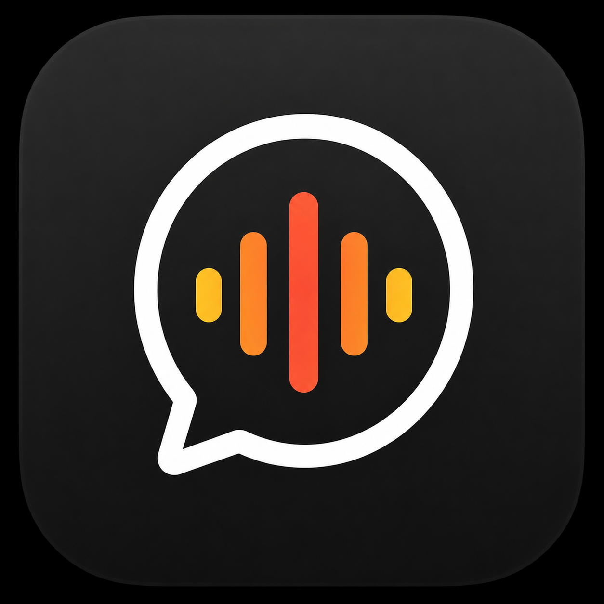
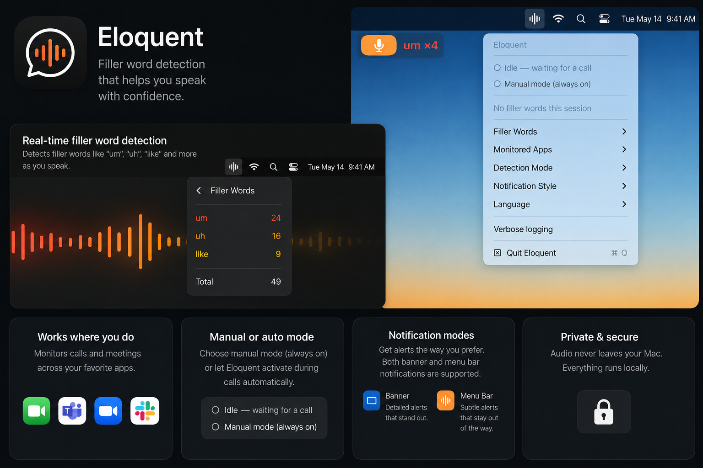

<div align="center">
  

  # Eloquent

  **Filler word detection that helps you speak with confidence.**

  A native macOS menu bar app that listens during calls and flags filler words
  ("um", "uh", "like", …) in real time. Everything runs **on-device** — no audio,
  transcript, or usage data ever leaves your Mac.
</div>

---



## Features

- **Real-time filler word detection** — catches "um", "uh", "like", "you know", and more as you speak.
- **A notification that feels alive** — filler words surface in a Dynamic-Island-style glass banner that springs down from the notch, with an animated waveform badge, a bold word label, and a repeat-count chip. Prefer something quieter? Switch to a menu-bar flash.
- **Works where you do** — detects when a call app (Microsoft Teams, Slack, Zoom, Webex, Discord, FaceTime) is using the microphone. Add any other app via a Finder picker.
- **Manual or auto mode** — let Eloquent activate automatically during calls, or flip on manual mode to monitor any time.
- **Session stats** — a color-ranked flyout shows how often you said each filler word this session, with a running total. Counts reset each new session.
- **Customizable** — tune the filler word list (including custom words), detection mode, notification style, and recognition language.
- **Private & secure** — powered by Apple's on-device `SpeechAnalyzer`. Audio never leaves your Mac.

## Design

Eloquent aims to feel at home among the best-crafted Mac apps:

- **Liquid-glass banner** — an `NSVisualEffectView` HUD pill with a hairline highlight edge, a warm orange gradient badge, and animated waveform bars that pulse when a word is flagged.
- **Fluid motion** — the banner springs in from the top with a subtle overshoot and retracts upward on dismiss, echoing the Dynamic Island.
- **Cohesive palette** — the same warm orange accent runs through the badge, the menu-bar flash, the frequency-ranked stats, and the menu's branded header.
- **Native and restrained** — SF Symbols throughout, system materials and typography, no heavy chrome.

## Requirements

- macOS 26 (Tahoe) or later
- Apple Silicon or Intel Mac
- Microphone and Speech Recognition permissions (requested on first launch)

## Building from source

Eloquent uses [XcodeGen](https://github.com/yonsm/XcodeGen) to generate its Xcode project.

```bash
# 1. Install XcodeGen (one-time)
brew install xcodegen

# 2. Generate the Xcode project
xcodegen generate

# 3. Open and run
open Eloquent.xcodeproj
```

Then build & run from Xcode (⌘R). On first launch, grant Microphone and Speech
Recognition access when prompted.

## Packaging a .dmg

```bash
./package.sh
```

Produces `build/Eloquent.dmg` with a drag-to-Applications installer layout. The
script prints the signing + notarization commands needed to distribute to other Macs.

## Architecture

| Area | Files |
|---|---|
| App bootstrap | `Eloquent/App/` — `main.swift`, `AppDelegate.swift`, `AppController.swift` |
| Call detection | `Eloquent/CallDetection/` — `CallDetector.swift`, `MicActivityWatcher.swift` |
| Speech engine | `Eloquent/SpeechEngine/` — `AudioCaptureEngine.swift`, `FillerWordRecognizer.swift`, `FillerWordMatcher.swift` |
| Menu bar UI | `Eloquent/MenuBar/StatusBarController.swift` |
| Banner overlay | `Eloquent/Overlay/` — `BannerOverlay.swift`, `BannerContentView.swift`, `Settings.swift` |
| Session stats | `Eloquent/Stats/SessionStats.swift` |

Speech recognition runs entirely on-device via Apple's `SpeechAnalyzer` /
`SpeechTranscriber` (macOS 26+). The engine only starts when a monitored call is
detected (or manual mode is on), keeping idle battery usage near zero.

## Distribution note

The current call-detection approach uses CoreAudio process enumeration, which is
incompatible with the Mac App Store sandbox. Eloquent is intended for **Developer ID /
direct `.dmg` distribution**. See [`RELEASE.md`](RELEASE.md) for details.

## License

Copyright © 2026. All rights reserved.
